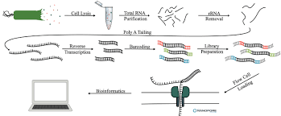
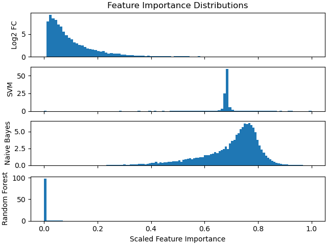
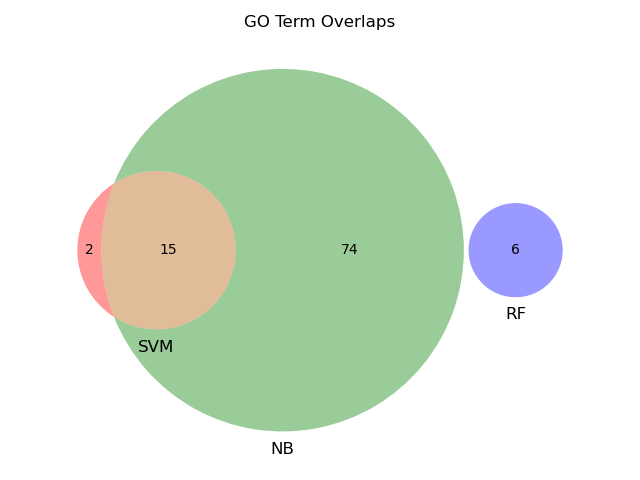

# Introduction

## Black Box Solvers
- Models that may provide accurate classification but
- Difficult to "debug" classifications
- can re-enforce existing biases/assumptions of researchers
- Examples
  - Deep Neural Networks
  - Convolutional NNs (image task)

## Informative Models in Bioinformatics
- Want a biological intuition behind some classification (e.g. regular vs cancer cells)
- Helps researchers and doctors understand genetic drivers of disease
- Allows prediction vs. patient specific information
- Examples
  - Logistic Regression
  - Random Forest
  - SVM
  - Naive Bayes

# Methods

## Transcriptomic Data

{height=100}

- use recount2 counts for TCGA (cancer, ) and GTEx (normal, 373) lung samples
- **Features:** gene-level transcript counts for $\sim$ 20,000 coding genes
- **Labels:** binary, cancer/not cancer

## Classifier with Informative Models
- chose classifiers that
  - provide feature importance values
  - relatively fast/simple
- Importance of feature (gene) $g$
  - **Naive Bayes:** $P(g|y)$ for $y=1$ (cancer)
  - **SVM:** contribution of $g$ to separating $y=0,y=1$
  - **Random Forest:** variability explained by $g$

## Importance Analysis
- extract feature (gene) importances from each model in predicting cancer
- compare most important genes and GO terms found by each model
- train classifier on chosen genes and compare to all genes

# Results

## Model Test accuracy
- prediction accuracy on the test set (n=289)
- **SVM:** 0.986
- **Naive Bayes:** 0.957
- **Random Forest:** 0.993

## Top 5 Most Important Genes

### SVM
- Eukaryotic Translation Elongation FACTOR 1/2
- surfactant protein C, associated with lung disease

### Naive Bayes
- all mitochondrial proteins

### Random Forest
- surfactant protein 2
- __SLC11A1__, associated with turbeculosis

## Gene Importance Distributions
{height=275}

## GO Analysis of Important Genes
- Gene Ontology (GO) groups genes by function/mechanism
{height=225}
- GO terms the most important genes across all methods?

## Model Re-training
- compare model trained on top 10, 50, 250, 500 and all genes separately
- where do precision and recall start to drop off?

# Conclusion

## Conclusion
- Even methods applied to the same problem with the same data can learn different things
- Underlying structure of a model is important to which features are learned
- There may be equally useful orthogonal ways to approach treating lung cancer

### Interpretable Deep Learning
- [Seninge et al.](https://www.biorxiv.org/content/biorxiv/early/2020/12/19/2020.12.17.423310.full.pdf) propose a VAE Enchange by Gene Annotations
- [Rybakov et al.](https://www.biorxiv.org/content/biorxiv/early/2020/12/03/2020.12.02.401182.full.pdf) propose a similar method, like PCA along Reactome elements
- Associate latent variables with Biological Abstractions (gene sets)
